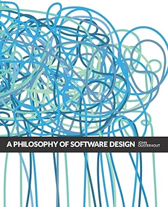
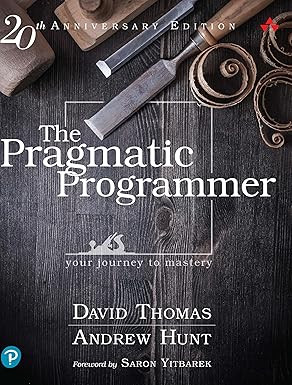
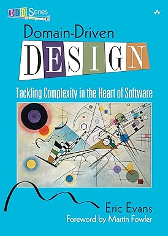
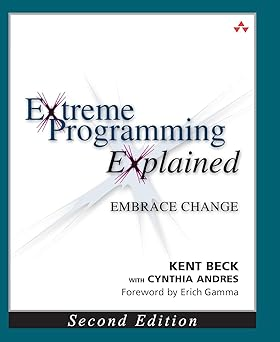

# What is a Claude Code Skill?

## Skills extend Claude's behavior

A **skill** is a markdown file that teaches Claude a new capability.

- Invoke manually with `/skill-name` in Claude Code
- Lives in your personal library: `~/.claude/skills/<skill-name>/SKILL.md`
- No code changes, no restarts — edit the file and it's live

## Skills can be dangerous

Skills run with your permissions, in your environment, with access to your files.

Public skill marketplaces have a real security problem:

- **Credential theft** — skills that read AWS keys, tokens, and config files and exfiltrate them to attacker servers
- **Malware installation** — skills that download and execute malicious payloads on your machine
- **Memory poisoning** — hidden directives injected into agent memory files that persist even after the skill is removed
- **Intent hijacking** — skills that silently execute unauthorized operations while appearing to do what you asked

::: {.callout-warning}
Security researchers have confirmed malicious skills in public marketplaces combining malicious code with prompt injection techniques.
:::

## The Three No's Principle

Before installing any skill from outside your own team:

::: {style="font-size: 0.75em;"}
| No. | Rule | Why |
|-----|------|-----|
| **1** | No unknown authors | Skills are code — treat them like a dependency. Check the author's GitHub history. |
| **2** | No excessive filesystem or network access | A skill that needs to read your `~/.aws` folder to "help with docs" is a red flag. |
| **3** | No skills without a public, inspectable source | If you can't read the `SKILL.md` before installing, don't install it. |
:::

::: {.callout-tip}
Matt's skills are open source, written by a known author, and fully inspectable before installation.
:::

::: {.callout-note}
Three No's Principle via [JadenNews on Medium](https://medium.com/@JadenNews/warning-about-341-malicious-skills-ai-agent-security-has-become-web3s-weakest-entry-point-2804103a75b4)
:::

## Learn More: Skill Security

| Source | What it covers |
|--------|---------------|
| [ThreatDown: Weaponizing Autonomy](https://www.threatdown.com/blog/weaponizing-autonomy-the-rise-of-malicious-ai-agent-skills/) | Attack vectors and memory poisoning in depth |
| [Snyk: ToxicSkills Audit](https://snyk.io/blog/toxicskills-malicious-ai-agent-skills-clawhub/) | First comprehensive security audit of a public skill marketplace |
| [The Hacker News: ClawHavoc](https://thehackernews.com/2026/02/researchers-find-341-malicious-clawhub.html) | Campaign analysis and platform response |
| [Medium: Warning About Malicious Skills](https://medium.com/@JadenNews/warning-about-341-malicious-skills-ai-agent-security-has-become-web3s-weakest-entry-point-2804103a75b4) | User-facing framing and the Three No's Principle origin |

# Meet Matt Pocock

## Who is Matt Pocock?

- TypeScript educator and open source author
- Creator of popular TS learning resources (Total TypeScript)
- Recently turned his attention to AI tooling and Claude Code skills
- Thesis: **classic software engineering principles matter more, not less, in the AI era**

::: {.callout-note}
"Software Fundamentals Matter More Than Ever" — [YouTube](https://www.youtube.com/watch?v=v4F1gFy-hqg)
:::

## His skills for engineers

Matt's skills repo: [github.com/mattpocock/skills](https://github.com/mattpocock/skills)

Today we focus on three skills that form a **planning pipeline**:

| Skill | Purpose |
|-------|---------|
| `/grill-with-docs` | Sharpen your idea through relentless questioning |
| `/to-prd` | Turn the sharpened idea into a Product Requirements Document |
| `/to-issues` | Break the PRD into agent-ready vertical slices |

## Installing Matt's skills

Matt Pocock's skills repo includes an install script that copies skills into your personal library.

```bash
# Clone and install
git clone https://github.com/mattpocock/skills
cd skills
./link-skills.sh
```

Skills are then available in every Claude Code session as `/skill-name`.

# The Planning Pipeline

## From rough idea to agent-ready issues

```{mermaid}
%%| fig-align: center
flowchart TD
  I["`Rough idea`"] --> A["`use
 /grill-with-docs
 to sharp domain model`"]
  A --> B["`use
 /to-prd
 to create the PRD`"]
  B --> C["`use
 /to-issues
 to create agent-ready issues`"]
```

Each skill picks up where the previous one left off, building on the conversation context.

# `/grill-with-docs`

## What it does

Interviews you relentlessly about your plan, one question at a time, until the domain is sharp and all ambiguity is resolved.

| | |
|---|---|
| **Input** | Your plan or idea (as conversation context) |
| **Output** | Resolved terminology, updated `CONTEXT.md`, optional ADRs |
| **When to use** | Before writing any spec — when the language is fuzzy |
| **Key behavior** | One question at a time, recommended answer included |

## Inside the skill

```markdown
Interview me relentlessly about every aspect of this plan
until we reach a shared understanding. Walk down each branch
of the design tree, resolving dependencies between decisions
one-by-one. For each question, provide your recommended answer.

Ask the questions one at a time, waiting for feedback on each
question before continuing.

If a question can be answered by exploring the codebase,
explore the codebase instead.
```

## DEMO {background-color="#1a1a2e"}

### `/grill-with-docs`

*Switch to terminal — run `/grill-with-docs` on the CLI task tracker repo*

# `/to-prd`

## What it does

Synthesizes the conversation context into a structured PRD and publishes it to the issue tracker. No additional interviewing — it works from what's already been established.

| | |
|---|---|
| **Input** | Conversation context from `/grill-with-docs` + codebase |
| **Output** | PRD published as a GitHub issue |
| **When to use** | After grilling, when the domain is clear |
| **Key behavior** | Looks for deep modules; no re-interviewing |

## Inside the skill

```markdown
Sketch out the major modules you will need to build or modify
to complete the implementation. Actively look for opportunities
to extract deep modules that can be tested in isolation.

A deep module (as opposed to a shallow module) is one which
encapsulates a lot of functionality in a simple, testable
interface which rarely changes.
```

::: {.callout-tip}
**A Philosophy of Software Design** — John Ousterhout
:::

## DEMO {background-color="#1a1a2e"}

### `/to-prd`

*Switch to terminal — run `/to-prd` continuing from the grilling session*

# `/to-issues`

## What it does

Breaks the PRD into independently-grabbable issues using vertical slices. Each issue cuts through all layers end-to-end and is either AFK (agent can run it) or HITL (needs human interaction).

| | |
|---|---|
| **Input** | PRD from `/to-prd` (issue number or conversation context) |
| **Output** | GitHub issues published in dependency order |
| **When to use** | After PRD is approved |
| **Key behavior** | Thin vertical slices; AFK vs HITL classification |

## Inside the skill

```markdown
Break the plan into tracer bullet issues. Each issue is a
thin vertical slice that cuts through ALL integration layers
end-to-end, NOT a horizontal slice of one layer.

- Each slice delivers a narrow but COMPLETE path through
  every layer (schema, API, UI, tests)
- A completed slice is demoable or verifiable on its own
- Prefer many thin slices over few thick ones
```

::: {.callout-tip}
**The Pragmatic Programmer** — David Thomas & Andrew Hunt
:::

## DEMO {background-color="#1a1a2e"}

### `/to-issues`

*Switch to terminal — run `/to-issues` on the PRD*

# What Just Happened?

## From idea to execution-ready plan

In three skill invocations, we went from a rough idea to:

- A **CONTEXT.md** with resolved domain terminology
- A **PRD** published as a GitHub issue with user stories, modules, and testing decisions
- A set of **vertical slice issues**, each independently grabbable by an agent

## The issues are agent-ready

Each issue produced by `/to-issues`:

- Describes an end-to-end behavior (not a layer)
- Has acceptance criteria
- Declares its blockers
- Is classified AFK (agent can run it) or HITL (human decision needed)

A fleet of parallel agents can now pick up the AFK issues and start building immediately.

# Classic SE Still Matters

## The books are in the skills

Matt's skills aren't just prompt wrappers — they encode opinions from decades of software engineering thought.

<table>
<thead><tr>
  <th colspan="2">Book</th>
  <th>Author</th>
  <th>Concept in the skills</th>
</tr></thead>
<tbody>
<tr>
  <td></td>
  <td>*A Philosophy of Software Design*</td>
  <td>John Ousterhout</td>
  <td>Deep modules in <br/><code>/to-prd</code></td>
</tr>
<tr>
  <td></td>
  <td>*The Pragmatic Programmer*</td>
  <td>Thomas &amp; Hunt</td>
  <td>Tracer bullets in <br/><code>/to-issues</code></td>
</tr>
</tbody>
</table>

The skills force the AI to think the way experienced engineers think — not just generate code, but design well.

# Where to Go Next

## Resources

**Matt Pocock**

- Skills repo + install script: [github.com/mattpocock/skills](https://github.com/mattpocock/skills)
- "Software Fundamentals Matter More Than Ever": [youtube.com/watch?v=v4F1gFy-hqg](https://www.youtube.com/watch?v=v4F1gFy-hqg)
- YouTube channel: [youtube.com/channel/UCswG6FSbgZjbWtdf_hMLaow](https://www.youtube.com/channel/UCswG6FSbgZjbWtdf_hMLaow)


## Further Reading

```{=html}
<div style="display: flex; justify-content: space-evenly; align-items: flex-start; width: 100%; padding-top: 8px;">

  <div style="text-align: center; width: 175px;">
    
    <div style="font-size: 0.85em; font-style: italic; margin-top: 4px; line-height: 1.2;">A Philosophy of Software Design</div>
    <div style="font-size: 0.72em; color: #555;">John Ousterhout</div>
  </div>

  <div style="text-align: center; width: 175px;">
    
    <div style="font-size: 0.85em; font-style: italic; margin-top: 4px; line-height: 1.2;">The Pragmatic Programmer</div>
    <div style="font-size: 0.72em; color: #555;">Thomas &amp; Hunt</div>
  </div>

  <div style="text-align: center; width: 175px;">
    
    <div style="font-size: 0.85em; font-style: italic; margin-top: 4px; line-height: 1.2;">The Design of Design</div>
    <div style="font-size: 0.72em; color: #555;">Frederick P. Brooks</div>
  </div>

  <div style="text-align: center; width: 175px;">
    
    <div style="font-size: 0.85em; font-style: italic; margin-top: 4px; line-height: 1.2;">Domain-Driven Design</div>
    <div style="font-size: 0.72em; color: #555;">Eric Evans</div>
  </div>

  <div style="text-align: center; width: 175px;">
    
    <div style="font-size: 0.85em; font-style: italic; margin-top: 4px; line-height: 1.2;">Extreme Programming Explained</div>
    <div style="font-size: 0.72em; color: #555;">Kent Beck</div>
  </div>

</div>
```

## Try it tonight

1. Install Matt's skills: `git clone https://github.com/mattpocock/skills && ./link-skills.sh`
2. Pick a project you've been putting off starting
3. Run `/grill-with-docs`, then `/to-prd`, then `/to-issues`
4. Hand the issues to an agent and watch it go
